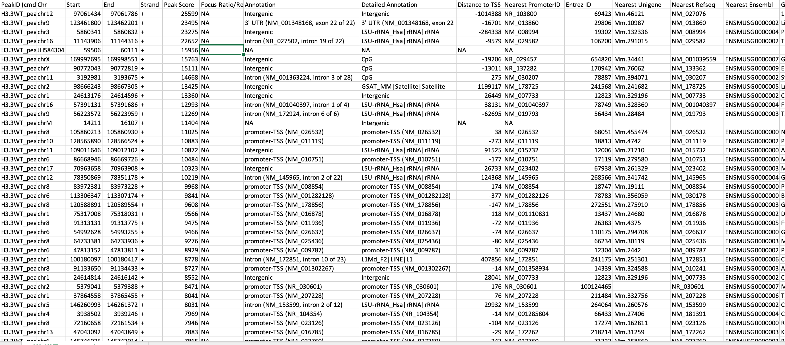

## How to annotate peaks in genome using Homer?

Homer contains a great program that annotates peaks in genome called [annotatePeaks.pl](http://homer.ucsd.edu/homer/ngs/annotation.html). To perform peak annotations to each sample, first install Homer via conda:  

```
conda install -c bioconda homer
```

Then make a directory in /results called /annotation: ```mkdir results/annotation```  and a log directory under /results/logs:``` mkdir results/logs/annotation```.

```
annotatePeaks.pl results/macs2/{samples}_peaks.narrowPeak mm10 > results/annotation/{samples}_annotate_homer.txt 2> results/logs/annotation/{samples}.log # Change the {samples} to the sample name you are annotating!
```

Homer does not pre-install annotation genomes, so you will come across this warning message:  
```
!!!!Genome mm10 not found in /exports/humgen/Jianhui/miniconda3/share/homer/.//config.txt

	To check if is available, run "perl /exports/humgen/Jianhui/miniconda3/share/homer/.//configureHomer.pl -list"
	If so, add it by typing "perl /exports/humgen/Jianhui/miniconda3/share/homer/.//configureHomer.pl -install mm10"

```

Type the code as this message guides:  
```
perl /exports/humgen/Jianhui/miniconda3/share/homer/.//configureHomer.pl -list
```

Once you find the genome that you want to annotate your peaks based on (e.g. We use mm10), install that genome:  
```
perl /exports/humgen/Jianhui/miniconda3/share/homer/.//configureHomer.pl -install mm10
```

**Note:** The installation path is customized, please copy paste the code as the warning message shown on your computer.  

After installing genome, we can run annotatePeaks.pl smoothly. Here is an example of annotating H3.3WT narrowPeak file:
```
annotatePeaks.pl results/macs2/H3.3WT_peaks.narrowPeak mm10 > results/annotation/H3.3WT_annotate_homer.txt 2> results/logs/annotation/H3.3WT.log
```
Check annotation process in ```results/logs/annotation/H3.3WT.log```. Homer not only associates a peak to the nearest gene and promoter, but also perform gene ontology analysis and genomic feature association analysis. The resulted txt file look like this:


You can basically annotate any BED/narrowPeak files by homer.
