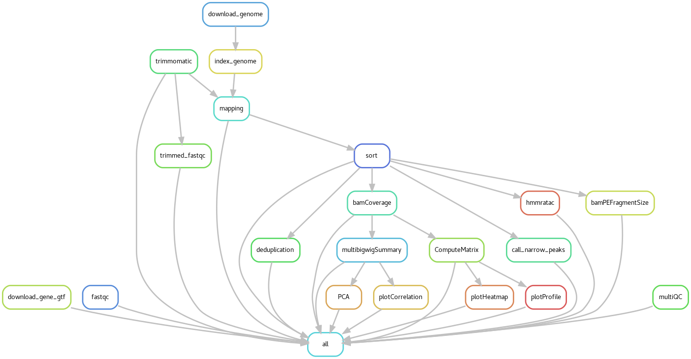

# Snakemake pipepine for (Illumina) paired-end ATAC-Seq data  
## Overview  
This pipeline implements an ATAC-seq data analysis workflow with Snakemake. The workflow includes three parts: pre-analysis, core analysis and downstream analysis. Starting from downloading raw data in fasta format, it runs basic QC reporting, reads trimming, alignment, peak calling and downstream analysis.

The expected outputs of this pipeline are:
* fastqc reports before and after trimming in _html_ format and a single multiQC report summary across all samples
* alignment files in _bed_ format.
* peak calling information by macs2, including _narrowPeak_ files.
* _bigwig_ files for visualization of coverage track on Genome Browser.
* [deeptools](https://deeptools.readthedocs.io/en/develop/content/list_of_tools.html) results:
  * fragment sizes distribution for paired-end reads
  * read density heatmap
  * profile plot
  * correlation heatmap
  * PCA plot

## Computer for running Snakemake  
Snakemake can work on any computer. To perform it on cluster computer like Slurm, we provide a script named "slurm_snakemake.sh" to kick it off. Do ``` nano slurm_snakemake.sh``` to modify the ```job-name``` and your email address after ```--mail-user```. Look for more information about cluster computer [SLURM](https://git.lumc.nl/shark/shark-centos-slurm-user-guide/-/wikis/home).  


```
#! /bin/bash

#SBATCH  --job-name=snakemake # You can change the job name.
#SBATCH --mail-type=ALL
#SBATCH --mail-user # Please insert your mail!
#SBATCH -t 48:00:00
#SBATCH --mem=60000


echo Start time : `date`
snakemake -p \
        --snakefile Snakefile \
        --latency-wait 60 \
        --wait-for-files \
        --rerun-incomplete \
        --use-conda \
        --cluster "sbatch --parsable --partition=highmem --mem=60g --ntasks=1 --cpus-per-task=8 --time=60:00:00 --hint=multithread" \
        --cluster-status "./slurm-cluster-status.py" \
        --jobs 30


echo End time : `date`
```
We have included "slurm-cluster-status.py" file which reports the job status while running.

## Quick Start  

### 1. Git clone the repository  
Try ``` git clone https://github.com/JihedC/Snakemake_ATAC_2020.git ``` to download the pipeline.
### 2. Snakemake installation
Install Snakemake [here](https://snakemake.readthedocs.io/en/stable/). You can install it via conda or pip:
```
conda install -c bioconda snakemake
```
or :
```
pip3 install snakemake
```
### 3. Conda activate an environment for running Snakemake  
This pipeline relies on [conda](https://docs.conda.io/en/latest/miniconda.html) to install packages. First you need to install Miniconda, then create a conda environment called "snakemake" with the following command: ```conda env create snakemake```, and activate this environment by ```conda activate snakemake``` to run the pipeline in snakemake environment.

The snakefile contains information about the required packages for the pipeline and will ensure the reproducibility of the analysis.

### Content of the repository  
* The **Snakefile** is the core of the Snakemake workflow. It ensures the reproducibility of the analysis by setting a set of rules and environments that will produce the desired outputs. This file is hard coded and should **not** be modified by unexperienced users.

* **Config.yaml** contains all the parameters you want to refer to, such as directory paths, genome file link, rule parameters, etc. You can also save those rarely-modified files such as ```genome.info``` in the configuration file. **Note: all paths in snakemake files are relative!** You can modify ```Config.yaml``` to make your pipeline more flexible: genome fasta, gene annotation, deeptools parameters, etc.

* **Envs/** contains conda environment sheets. Every rule that requires tool installation from conda has a separate ```*.yaml``` file. ```channels``` refers to which channel of conda you use, and ```dependecies``` refers to the exact version of this tool. To avoid tool conflicts with python, we usually use an older version of a tool. To ensure reproducibility, the environments should not be modified.

* **units.tsv** is a _tab separated value files_ containing information about the experiment name and path to the fastq files relative to the Snakefile. Change this file according to your samples. Fill in the sample names and relative paths when you analyze your own data. It always needs to contain the columns ```sample``` (sample names), ```fq1``` (forward reads fastq file) and ```fq2``` (reverse reads fastq/fasta/fastq.gz/fasta.gz file). Columns have to be **tab separated**, otherwise an error message will occur:
```
Error in rule trimmomatic:
    jobid: 5
    output: temp/trimmed/KO1     ../data/sample_4_7_R1.fastq.gz  ../data/sample_4_7_R2.fastq.gz_forward.fastq.gz, temp/trimmed/KO1     ../data/sample_4_7_R1.fastq.gz  ../data/sample_4_7_R2.fastq.gz_reverse.fastq.gz, temp/trimmed/KO1     ../data/sample_4_7_R1.fastq.gz  ../data/sample_4_7_R2.fastq.gz_forward_unpaired.fastq.gz, temp/trimmed/KO1     ../data/sample_4_7_R1.fastq.gz  ../data/sample_4_7_R2.fastq.gz_reverse_unpaired.fastq.gz
    log: results/logs/trimmomatic/KO1     ../data/sample_4_7_R1.fastq.gz  ../data/sample_4_7_R2.fastq.gz.log (check log file(s) for error message)
    conda-env: /exports/humgen/Jianhui/pipeline_test/Snakemake_ATAC_2020/ATAC-seq_pipeline/.snakemake/conda/951e989c
    shell:

        trimmomatic PE         -threads 10         -phred33                    temp/trimmed/KO1     ../data/sample_4_7_R1.fastq.gz  ../data/sample_4_7_R2.fastq.gz_forward.fastq.gz temp/trimmed/KO1     ../data/sample_4_7_R1.fastq.gz  ../data/sample_4_7_R2.fastq.gz_forward_unpaired.fastq.gz temp/trimmed/KO1     ../data/sample_4_7_R1.fastq.gz  ../data/sample_4_7_R2.fastq.gz_reverse.fastq.gz temp/trimmed/KO1     ../data/sample_4_7_R1.fastq.gz  ../data/sample_4_7_R2.fastq.gz_reverse_unpaired.fastq.gz          ILLUMINACLIP:adapters.fasta:2:30:10          LEADING:3          TRAILING:3          SLIDINGWINDOW:4:15          MINLEN:40 &>results/logs/trimmomatic/KO1     ../data/sample_4_7_R1.fastq.gz  ../data/sample_4_7_R2.fastq.gz.log

        (one of the commands exited with non-zero exit code; note that snakemake uses bash strict mode!)

Shutting down, this might take some time.
Exiting because a job execution failed. Look above for error message
Complete log: /exports/humgen/Jianhui/pipeline_test/Snakemake_ATAC_2020/ATAC-seq_pipeline/.snakemake/log/2021-02-19T114154.551567.snakemake.log
```
Because samples are not separated well in units.tsv, snakemake would take samples in a row as a single sample.

### 4. Test it on your computer  

This pipeline includes a set of small fastq files of mouse genomic data for testing.
* **Change units.tsv** Change the sample names and relative paths accordingly. The pipeline includes samples, so you can use it to quickly test whether all environments are installed.
* **Change genome file** Change 'genome_fasta_url' item in configfile to download the genome that you want to reference.
* **Set binSize value** We set the default binSize value at 1000bp for testing. Remember to change it to small values (e.g.10) when using your data by altering "--binSize" argument of rule _computeMatrix_.
* **Select normalization method** Normalization methods include RPKM, CPM, BPM and RPGC. Our pipeline uses RPKM by default. You can set it after "--normalizeUsing" argument of rule _bamCoverage_.
* **Set matrix parameters** By default the pipeline uses reference-point mode. Alternatively you can change it to scale-regions. Correspondingly you should specify "--regionBodyLength" argument of rule _computeMatrix_.

How to make a test run:  
1. Activate snakemake environment by ```conda activate snakemake```.  
2. Go to Snakemake_ATAC_2020/ATAC-seq_pipeline/ folder and do ```snakemake -np``` to make a dry run to test whether the workflow is defined properly.  
3. If no error messages occur during dry run, start a real run. You can either do it in an interactive session by typing ```snakemake --use-conda --cores n```; or on the node by typing ```sbatch slurm_snakemake.sh``` to hand in the submission script to Slurm.

### 5. Snakemake execution  

Snakemake workflow management system is a tool to create reproducible data analysis. It executes steps by reading _Snakefile_.
* Test run
After activating snakemake environment, use command ```snakemake -np``` to perform a dry run. If there is no error messages, you can start a real run.  
* Real run
Within the folder containing the Snakefile, simply run this command line ```Snakemake --use-conda --cores n ```. n is the number of cores you want to dedicate for the analysis.

Or, run snakemake on user node on Slurm by typing ```sbatch slurm_snakemake```. This command line will allocate snakemake jobs to available computer nodes. Check job status by ```squeue -u <username>```, where "R" means running and "PD" means pending. View the progress of each job by ```less slurm-*.out```.

## Output description  

The desired output of this pipeline are:

* **Quality check files of raw data and trimmed data**. Fastqc tool processed and generated quality check reports in html format, which are stored in results/fastqc/ folder. Multiqc analyzes across all samples into a single QC report named "multiqc_report.html", and store extra information in multiqc_data/ folder under results/trimmed_fastqc/ folder.
* **Alignment files along with indexes**. BAM is short for "Binary Alignment Map", which is a compressed binary version of SAM (Sequence Alignment Map) file. BAM files are quite large so one could decide to have them erased after all analysis is done. They can be useful for other downstream analysis (e.g deeptools). Stored in temp/sort/ folder.  
* **Peaks**. These files gather the peak information processed by MACS2. _.narrowPeak_ files includes standard BED files and statistical significance information. Stored in results/macs2/ folder.  
* **Coverage tracks**. _.bigwig_ files are used for visualizetion on Genome Browser. Stored in results/bamCoverage/ folder.  
* **Fragment size distribution** A histogram showing fragment size distribution is generated in /results/bamPEFragmentSize/ folder.  
* **Correlation heatmap** A correlation heatmap showing similarity between samples is stored in /results/correlation/ folder.  
* **Read density heatmap** A read density heatmap over reference point is stored in /results/heatmap/ folder.  
* **Profile** A profile plot showing peak coverage for all samples over reference point is stored in /results/profile/ folder.  
* **PCA plot** A PCA plot giving deeper insights into similarity between samples is storede in /results/PCA/ folder.

## What do rules do?  
* pre-processing.smk:
  * **rule trimmomatic:** Trim the adapters and N bases.
  * **rule trimmed_fastqc:** As confirmation, check the quality again after reads are trimmed.
  * **rule fastqc:** Check the quality of sequenced reads.
  * **rule multiQC:** Produce a QC summary report across all samples.
  * **rule mapping:** Align trimmed reads with indexed genome.
  * **rule sort&index:** Sort the alignments of BAM file based on chromosomes and index them.
  * **rule deduplication:** Mark the duplicates and remove them.

* macs2.smk:
  * **rule call_narrow_peaks:** Identify reads-enriched regions, namely accessible regions using Macs2. The output files include _.narrowPeak_, which is used for downstream analysis (e.g. deeptools).   

* external_data.smk:
  * **rule download_genome:** Download reference genome.
  * **rule download_gene_gtf:** Download gene annotations file.
  * **rule index_genome:** Index reference genome to allow the aligner to narrow down the potential origin of a query sequence within the genome. This saves both time and memory.

* deeptools.smk:
  * **rule bamCoverage:** Convert BAM files to bigwig files that can be visualized on genome browser.
  * **rule multibigwigSummary:** Compute the average scores for each of the files in every genomic region. The output could be used by plotPCA for visualization.
  * **rule PCA:** The PCA plot shows whether samples display greater variability between experimental conditions than between replicates of the same treatment.
  * **rule ComputeMatrix:** Calculate scores per genome regions and prepares an intermediate file that can be used by plotHeatmap or plotProfile.  
  * **rule plotHeatmap:** Visualization of peaks over reference point (by default: TSS).  
  * **rule plotProfile:** Visualization of profiles over reference point (by default:TSS).
  * **rule bamPEFragmentSize:** Generate a histogram that display distribution of fragment sizes.  
  * **rule plotCorrelation:** Plot a correlation heatmap that shows how similar samples are with each other.  

## Configuration file  
* working_dir: a directory that contains temporary files.
* result_dir: a directory taht contains desired output files
* data_dir: a directory that stores all the sample data. Sample paths in units.tsv direct here
* units.tsv: a table that indicates sample names and paths. Paired-end sequencing data are accepted and forward reads should be in the column "fq1" and reverse reads should be in the column "fq2". This table should be **tab delimited**
* genome_fasta_url: the link to reference genome
* adapters: adapters.fasta file that is used by trimmomatic. This file is fixed as long as the reads are sequenced by Illumina.
